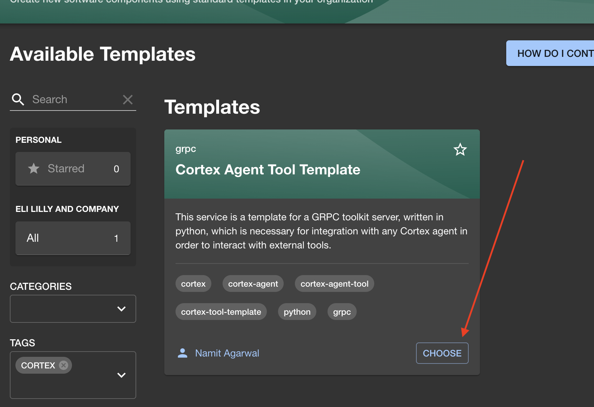
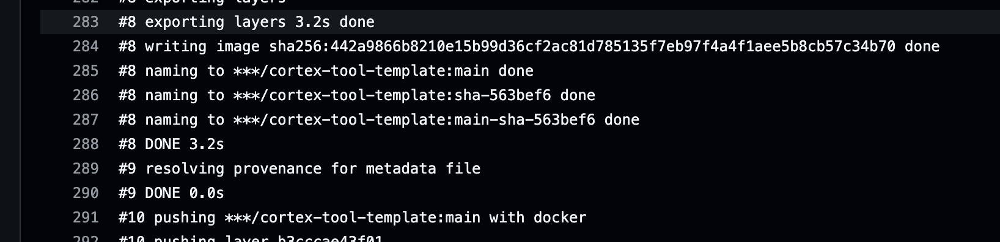

# Cortex Tool Server Template

This repo contains a GRPC toolkit server which is necessary for integration with any Cortex agent in order to interact with external tools.

## Tool Interface Overview

In order for a Cortex model to interact with external functionality, the server that will need to act as a tool server by implementing the accepted tool interface. The modle toolkit configuration that will direct the model to interact with the tool server.
- The tool server exposes 2 main RPCs:
  -	`DescribeTools`: Provides a list of available tools with names and descriptions. An agent uses this to see what tools it can use and how they work.
  -	`ExecuteTool`: Executes a requested tool and returns the response. An agent will call this RPC to use a tool.
- All tool servers must adhere to the expected GRPC prototype for compatibility, but the underlying architecture for how to describe, track, and execute tools is up to the developer.

## Getting Started
1. To use this template, navigate to [Backstage Accelerators](https://backstage.apps.lrl.lilly.com/create?filters%5Bkind%5D=template&filters%5Btags%5D=cortex) and select the desired cortex accelerator.
   - Navigate through the prompts to generate your new repository



2. Run `make setup`
   - This command will install necessary dev tooling (linters, formatters, pre-commit hooks, etc.)
   - This command will also generate a new virtual environment and install all app dependencies. Once complete, run `source .venv/bin/activate` to activate your new python environment
3. Replace all instances of `cortex_tool_template`, `cortex-tool-template`, etc. with the desired name of your repo
5. Run `make proto` to generated the required python files from the proto definitions
6. Test the tool
   - This template includes a test client located in `testing/client.py`. Run both the `server.py` file to start the tool locally, and run the `testing/client.py` file to call the tool locally and test its execution.
   - If the test is successful, congratulations! You have successfully completed setup of your new tool and you are free to modify your new tool!

| NOTE: There are additional helpful commands available in the `Makefile` for setup, build, cloud services, etc.

## Hosting a GRPC Toolkit Server on CATS

First, ensure appropriate branches are set up on the target repo
- eg. develop, main, etc.

Next, follow these steps to set up the server on the CATS DEV cluster (similar steps apply for the PROD cluster):
1. Follow the CATS pre-requisites to set up the repo
- https://cats.lilly.com/guide/Prerequisites
2. Run CI/CD pipeline and grab sha from the build step:


- copy the sha into the `initialSha` value of the appropriate helm values file. This will establish a base image for CATS deployments

Set up CATS infrastructure
1. Make sure you have appropriate access and permissions:
   - https://dev.lilly.com/docs/platforms-and-tools/cats/
2. Update the template output dir in the [gitignore](.gitignore) with your repo name
3. Modify your namespace YAML to add an `sg-rule` allowing ingress from the `llm-dev` namespace on your exposed port. Refer to [SG Rule Docs]( https://github.com/EliLillyCo/LRL_light_k8s_infra_apps/blob/main/examples/sg-rule.md) for details.
```json
"ingress_rules" : [{
	"namespace_allow_from": "llm-dev",
	"port": 50051
}]
```
4. Run `make templates` or `make templates env=<env>`
   - this command will use helm to output the appropriate kubernetes manifest files in the `helm/<REPO_NAME>`
   - it will use the dev config by default
5. Open a PR in the CATS Infra Repo
   - [Dev Cluster](https://github.com/EliLillyCo/LRL_light_k8s_infra_apps_test)
   - [Prod Cluster](https://github.com/EliLillyCo/LRL_light_k8s_infra_apps)
   - Create a new folder in the appropriate `projects/<env>` folder (dev, qa, prd)
   - Copy the output files from the repo into the new folder in the CATS repo
6. (Optional) Test to check the deployment is set up correctly by running a `curl` command from `llm-dev` to your server. If set up correctly, the response should indicate the connection is not allowed due to GRPC not supporting curl. If not, curl will hang.
```bash
curl http://[service-name].[namespace-name].svc.cluster.local:50051
```

With this configuration, flux will trigger automatic updates whenever a new image is pushed from CI/CD.

## Cortex Integration
1. Go to the Cortex docs page: <https://chat.apps-d.lrl.lilly.com/docs>.
2. In the `/manage/toolkit_config` endpoint, create a new toolkit, filling the server field with the server address and port. Do not include `http://`, as it is automatically added. Ensure to include the name of the new model in the `auth_models` list.
```json
"server" : "[service-name].[namespace-name].svc.cluster.local:50051"
"auth_models": [ "new-model-name" ]
```
3. In the `/manage/config` endpoint, create a new model. Ensure the toolkit's name is added to the `toolkits` list, and to include the "tool-chain" in the chain section of the config.
```json
"chain": [{"chain_class": "tool-chain", "model_iteration": 1,"order": 1}],
"toolkits": ["new-toolkit-name"]
```
4. The new agent and toolkit should have been successfully created. If everything is set up correctly the model should be able to answer prompts related to the provided tools and use them correctly. If the model isn’t working, here are potential problems:
   - Is your model working for non-tool related prompts? Then the tool server is correctly connected but the execution of certain tools are likely causing an error. Check the tool execution on the toolkit server. Use the `/manage/{toolkit_config}/toolkit_execute` to test specific tools from Cortex.
   - Is your model always returning an error to any prompt? Then the tool server is not correctly connected. Use the `/manage/{toolkit_config}/toolkit_describe` to check the health of your toolkit server.
   - Does the describe endpoint not work? Then the llm-dev namespace is unable to find and connect to your tool server. Double check the address of the toolkit config. Try to curl to the GRPC server from the llm-dev namespace. Double check the exposed ports on the GRPC server and the sg rules.
   - Is your toolkit server not deploying on CATS? Double check to see if the CATS configuration is correct. Run your container locally to check it can deploy correct. Reach out to the CATS team if problems persist.

## Next Steps

This template is only meant to serve as a bare-bones, un-opinionated base for new Cortex Tooling. It is not feature complete and does not impose any recommendations on best practices. It is recommended to determine the ideal technologies, architecture and configuration on a case by case basis for each new tool.

## Appendix

CATS onboarding docs
- https://cats.lilly.com/guide
